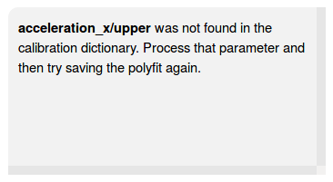

.. _calibration:

Calibration
===========
.. note:: Currently only tag model W190PD3GT is covered, but other tags will be
          added as opportunity permits.

Accelerometer
-------------
.. note:: The calibration procedure described below needs review (particularly
          the orientation of the sensor for the associated gravitational
          forces). This will be updated to be a thorough explanation in
          subsequent releases of the documentation.

The data provided by the Little Leonardo dataloggers are presented in a raw
format which need to be adjusted to units of gravity (**g**). Within a period
of approximately one month adjacent to collection of data, a calibration file
should be created using the process described below.

Collecting calibration data
~~~~~~~~~~~~~~~~~~~~~~~~~~~
First configure and activate the datalogger for recording. For a period of
approximately 10 seconds orient the tag in each of the following
orientations, one axis at a time. Longer durations make visually identifying
these periods in the data easier.

+--------+--------------------------------+--------------------------------+
|        | **+g** orientation             | **-g** orientation             |
+--------+--------------------------------+--------------------------------+
| **X**  | .. image:: /images/cal/t1.png  | .. image:: /images/cal/t2.png  |
|        |    :align: center              |    :align: center              |
+--------+--------------------------------+--------------------------------+
| **Y**  | .. image:: /images/cal/t3.png  | .. image:: /images/cal/t4.png  |
|        |    :align: center              |    :align: center              |
+--------+--------------------------------+--------------------------------+
| **Z**  | .. image:: /images/cal/s1.png  | .. image:: /images/cal/s2.png  |
|        |    :align: center              |    :align: center              |
+--------+--------------------------------+--------------------------------+

Running the calibration software
~~~~~~~~~~~~~~~~~~~~~~~~~~~~~~~~
Calibration is performed on accelerometer sensor data that does not have
accompanying magnetometer or gyroscope data by performing by making a linear
fit between a collection of points occurring at **-g** and  **+g** orientations
of an axis. This fit can then be applied to the original accelerometer count
data to transform the data into units of **g**.

Launching the application
+++++++++++++++++++++++++
An application for simplifying the calibration process (made with the `bokeh
<http://bokeh.pydata.org/en/latest/>`_ visualization library) has been included
with `pylleo` as an executable script, which launches a bokeh application in
your web-browser.

The script is automatically installed with `pylleo`, just run it from the
command-line with an option for specifying how it opens in your browser:

.. code::

    Usage: pylleo-cal [OPTIONS]

      Calibrate accelerometer data

    Options:
      --new TEXT  Method to open application in browser. "tab" opens the
                  application in a new browser, and "window" opens it in a new
                  browser window.
      --help      Show this message and exit.

The following page should appear in your browser, and the application will shut
itself down when you close this page:

.. image:: /images/calapp/screen_start.png
   :align: center

By zooming into segments of data when the datalogger was at one of the two
orientations described above, a selection tool can be used to select those data
points to be used for calibration. The start and stop index positions for each
of these segments are saved to a file in the data directory `cal.yml`, and
once all indices have been saved the fit coefficients can be calculated and
saved to the same file. These coefficients can later be used for applying the
fit to the data points using the routine `lleocal.calibrate_accelerometer()`.

The tools for zooming and selecting the data are in the top right
hand corner of the page. A summary table of the tools used in the app
(shown below) have been taken from the `Bokeh` `documentation for plot
tools
<http://bokeh.pydata.org/en/latest/docs/user_guide/tools.html#configuring-plot-tools>`_.

.. |pan| image:: /images/calapp/tool_pan.png
.. |boxz| image:: /images/calapp/tool_boxzoom.png
.. |boxs| image:: /images/calapp/tool_boxselect.png
.. |wheel| image:: /images/calapp/tool_wheel.png
.. |hover| image:: /images/calapp/tool_hover.png

+----------+------------------------------------------------------------------+
| **Icon** | **Bokeh documentation description**                              |
+----------+------------------------------------------------------------------+
| |pan|    | The pan tool allows the user to pan the plot by left dragging    |
|          | the mouse or dragging a finger across the plot region.           |
+----------+------------------------------------------------------------------+
| |boxz|   | The box zoom tool allows the user to define a rectangular region |
|          | to zoom the plot bounds too, by left-dragging a mouse, or        |
|          | dragging a finger across the plot area.                          |
+----------+------------------------------------------------------------------+
| |boxs|   | The box selection tool allows the user to define a rectangular   |
|          | selection region by left-dragging a mouse, or dragging a finger  |
|          | across the plot area.                                            |
+----------+------------------------------------------------------------------+
| |wheel|  | The wheel zoom tool will zoom the plot in and out, centered on   |
|          | the current mouse location. It will respect any min and max      |
|          | value ranges preventing zooming in and out beyond these.         |
+----------+------------------------------------------------------------------+
| |hover|  | The hover tool is a passive inspector tool. It is generally on   |
|          | at all times, but can be configured in the inspectors menu       |
|          | associated with the toolbar.                                     |
+----------+------------------------------------------------------------------+

Loading data
++++++++++++
All of your data should be organized in their own directories within one
"parent" directory. Copy-paste the *full path* to this parent directory to the
text input field labeled "Parent directory".

.. image:: /images/calapp/input_parent.png

The drop-down list labeled "Data directories" will then propagate with a list
of the directories in your parent directory. The data from the first directory
in the list will be loaded into the plot. To select a different directory,
select it from the list and its data will be loaded.

.. image:: /images/calapp/select_datadirs.png

Selecting data
++++++++++++++
The app first loads all three axes of acceleration data, which from time to
time may be helpful to view at the same time for comparing differences between
the axes in +g/-g orientations. When selecting the index positions for the
start and end of the calibration orientation regions, it is usually easiest to
have only one axis displayed at a time.

To start with the x-axis, de-select the y and z axes under the text "Axes to
Display" by clicking on the buttons with their respective labels:

.. image:: /images/calapp/button_axes.png

Make sure the data parameter (i.e. accelerometer axis) you wish to select
calibration indices for is selected:

.. image:: /images/calapp/select_parameter.png

And the "bound" (i.e. the +g or -g position for that axis):

.. image:: /images/calapp/select_bound.png

Assuming the calibration sequence was performed before the deployment of the
datalogger, zoom this region of data using the |boxz| tool:

.. image:: /images/calapp/zoom_box-region.png

If the calibration sequence of orienting the datalogger was performed
correctly, it should be obvious to see where the +g/-g positions are in the
data:

.. image:: /images/calapp/plot_hilo.png

Zoom in again to the region corresponding with the bound you are selecting
indices for, "lower" or "upper":

.. image:: /images/calapp/zoom_box-bound.png

Then using the |boxs| tool, click and drag across a section of data without
large amounts of variation.

.. image:: /images/calapp/select_box-bound.png

Notice that the `start` and `end` index position values have updated to the
positions of the start and end of the horizontal area selected:

.. image:: /images/calapp/input_indices.png

Saving the index values
+++++++++++++++++++++++
Once you have `start` and `end` index values for the region you are working
with (e.g. `accelerometer_x/lower`), Click the button labeled "Save Index
Values":

.. image:: /images/calapp/button_indices.png

You should then see a message displayed in the gray box to the right of the
selection menu letting you know that the index positions for that region saved
correctly to the `cal.yml`. This message includes the data parameter and bound
you have selected and the `start` and `end` index positions you have selected:

.. image:: /images/calapp/terminal_update-success.png

Once completed, you can zoom out again using the |wheel| tool to perform these
steps on the "upper" region. Be sure to select the correct data parameter and
bound before saving the next index positions.

Then repeat these steps for the `x` and `y` axes until you have saved the index
positions for all calibration orientation regions:

* `acceleration_x/lower`
* `acceleration_x/upper`
* `acceleration_y/lower`
* `acceleration_y/upper`
* `acceleration_z/lower`
* `acceleration_z/upper`

Saving the polyfit coefficients
+++++++++++++++++++++++++++++++
Once you have saved all of the index positions for all calibration orientation
regions, click the button labeled "Perform Polyfit":

If the coefficients were able to successfully save to the `cal.yml` file, you
should get a message in the gray box as follows:

If you are missing any index positions, you will get a message indicating the
first of the missing regions you must select and save before you can perform
the polyfit:

Propeller
---------

Collecting calibration data
~~~~~~~~~~~~~~~~~~~~~~~~~~~
First configure and activate the datalogger for recording. You must then move
water over the datalogger's propeller at known speeds, logging the speed of
water movement, the exact start, and exact end times in spreadsheet with a
preceding `id` column, saving it as a `csv` file as shown below.

As with the accelerometer file, a calibration of the propeller sensor should be
performed within approximately 1 month of each deployment of the datalogger.

.. code::

    id,start,end,est_speed,count_average
    00,start,end,speed,
    ...
    99,start,end,speed,

Running the calibration software
~~~~~~~~~~~~~~~~~~~~~~~~~~~~~~~~
With the collected data loaded using `pylleo`. Find the timestamp in
`data['datetimes']` closest to the logged start and end times, then calculate
the average count the propeller turned between each sample.

.. code:: python

    from pylleo import lleocal

    cal_fname = 'speed_calibrations.csv'

    cal = lleocal.create_speed_csv(cal_fname, data)
    data = lleocal.calibrate_propeller(data, cal_fname)
